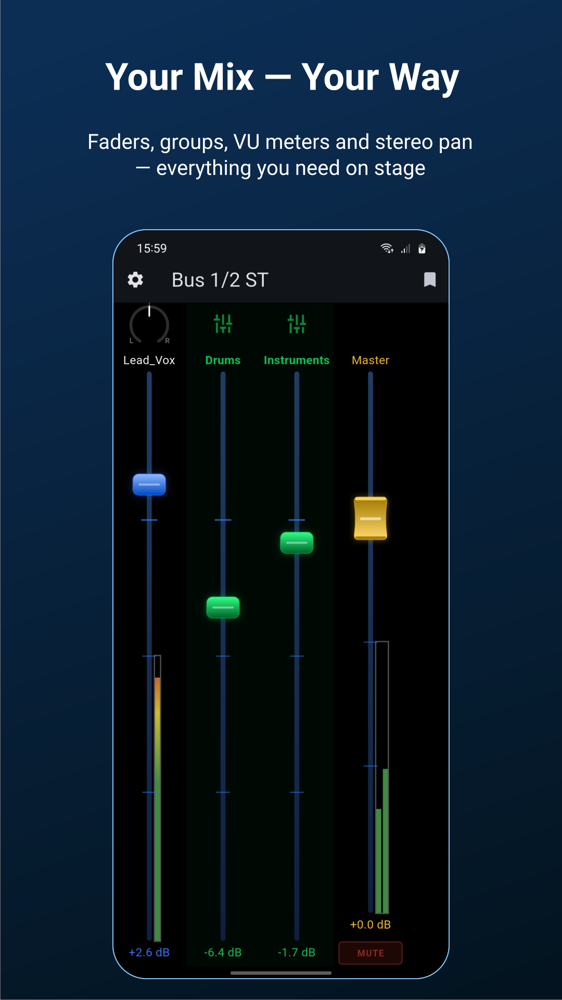
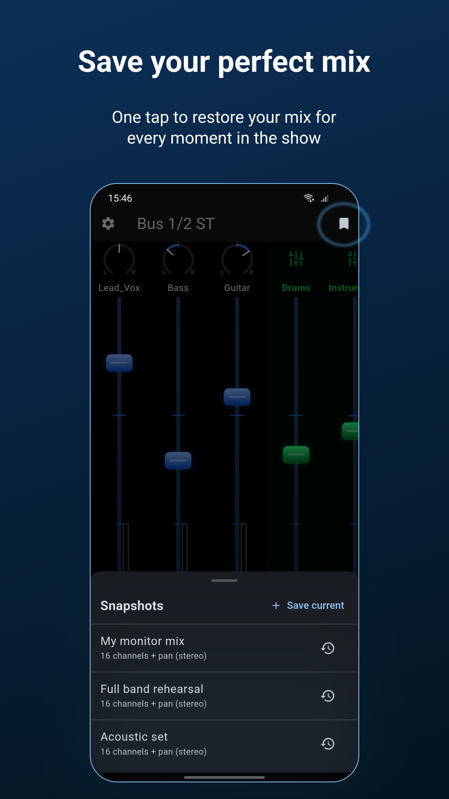
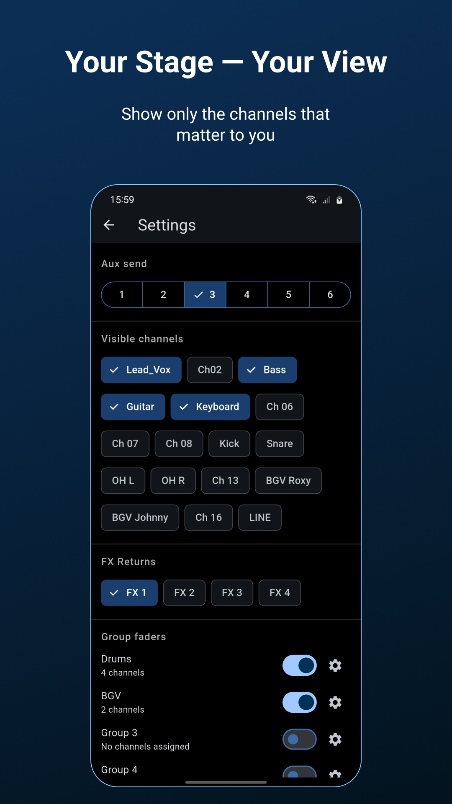
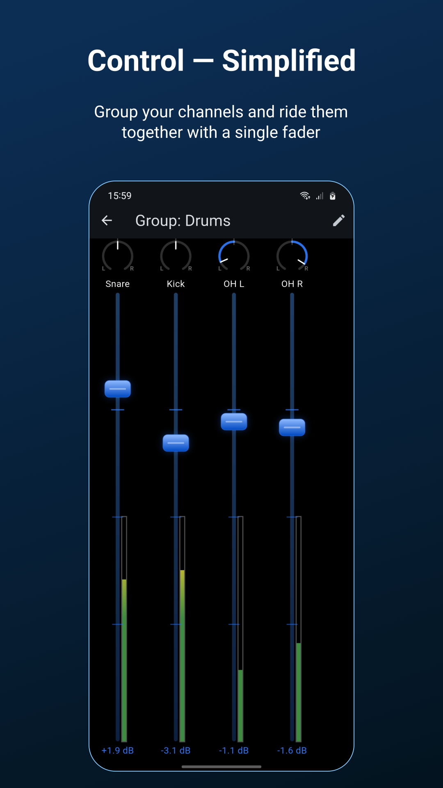
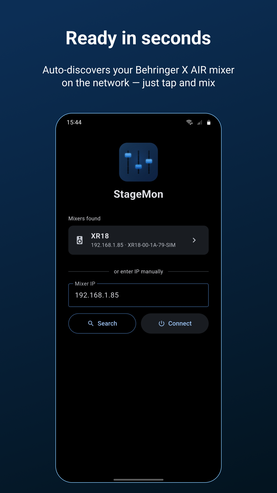
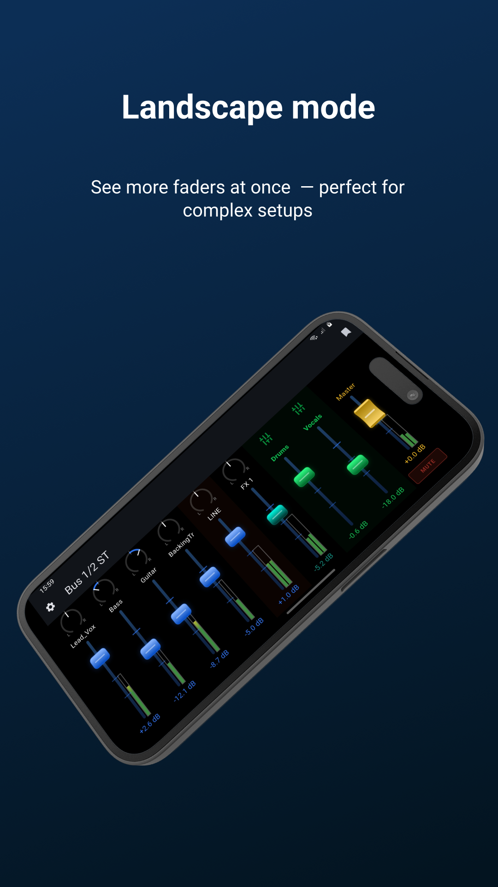

# StageMon

A Flutter app for controlling monitor mixes on a **Behringer XR18 / X AIR** mixer via OSC/UDP.

Designed for live sound: each musician on stage can use StageMon to adjust their own monitor mix in real time, without touching the main console.

---

## Features

- **Auto-discovery** — finds XR18 consoles on the local network automatically
- **Try without a mixer** — a built-in simulator mode lets you try the app (faders, groups, snapshots, VU meters) without a real console nearby
- **Per-bus fader control** — sends individual channel levels to any of the 6 aux buses
- **Stereo bus support** — detects paired buses (1/2, 3/4, 5/6) and shows pan knobs automatically
- **VCA-style group faders** — move multiple channels together while preserving relative levels
- **Snapshots** — save and restore complete mix states (levels, pans, aux master)
- **Layouts** — save a screen setup (visible channels, groups, colors, fader sizes, and optionally the aux bus) under a name, reload it later, and share it to another device
- **Channel and bus colors** — color-code channels, LINE, FX returns, MASTER, and group faders using the mixer's own 16 scribble-strip colors, or sync automatically to whatever color is set on the console
- **Pinch-to-resize faders** — pinch with two fingers over the faders to show more or fewer channels at once, on the mixer screen and inside a group; each keeps its own size
- **VU meters** — real-time channel and bus level indicators
- **Channel visibility** — show only the channels that matter for each monitor mix
- **Stays awake while connected** — the screen won't lock during a show; it just dims after your phone's normal timeout and brightens on the next touch
- **Dark theme** optimized for stage use

## Screenshots

<table>
  <tr>
    <td></td>
    <td></td>
    <td></td>
  </tr>
  <tr>
    <td></td>
    <td></td>
    <td></td>
  </tr>
</table>

## Requirements

- Flutter 3.38 or later
- A Behringer XR18, X18, or Midas MR18 mixer (including the V2 hardware revisions) on the same Wi-Fi network
- Android or iOS device

Other X AIR consoles (e.g. XR16, XR12) share the same OSC protocol and should connect as well, but since StageMon assumes the XR18's 16-channel layout, some of the channels shown in the app won't correspond to a real channel on consoles with fewer physical inputs.

## Getting started

```bash
git clone https://github.com/Via-Nubium/StageMon.git
cd stagemon
flutter pub get
flutter run
```

## Development tools

The `tools/` folder contains two standalone Python utilities, useful outside the app (e.g. for testing the OSC protocol directly):

- **`xr18_simulator.py`** — simulates an XR18 mixer for testing without hardware. No external dependencies.
  ```bash
  python tools/xr18_simulator.py
  ```
- **`osc_listener.py`** — listens on UDP port 10024 and prints incoming OSC messages.
  Requires `pip install python-osc`.

## License

MIT License — Copyright (c) 2026 Via Nubium. See [LICENSE](LICENSE) for details.

This software is provided "as is", without warranty of any kind. Use at your own risk.
